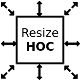

# Resize HOC

A high order React component to decorate any component with resize functionality.

## Example

Simple resizable box:
https://jsfiddle.net/mauron85/krhub6e7/

React-virtualized table:
https://jsfiddle.net/mauron85/cr0qvs13/

## Use case

Your component has to have width and height defined. If your component is using relative units (eg. `width: 100%`), this component is not for you.

## Motivation

There are severe React components with similar functionality:

### [react-resizable-box](https://github.com/bokuweb/react-resizable-box)

* expect element to be centered with `margin: auto` to work in all directions

### [react-resizable-component](https://github.com/wongherlung/react-resizable-component)

* parent has to have 100% width for live resizing
* allow resizing only one direction

### [react-resizable](https://github.com/STRML/react-resizable)

* allow to resize in bottomRight direction only

However using resizeHOC has some benefits:

* live resize without any props callbacks
* play nicely with complex components like react-virtualized list, table, grid...

## Usage

``` javascript
const ResizableComponent = resizeHOC(options)(YourComponent);
```

## Options

directions: ['top', 'right', 'bottom', 'left', 'topRight', 'bottomRight', 'bottomLeft', 'topLeft']

## Lifecycle functions

All licycle functions has to be passed as props into decorated component.

``` javascript

...
<ResizableComponent
	width={width}
	height={height}
	onResizeStop={func}
/>
...
```

### onResizeStop({ top: Number, left: Number: width: Number, height: Number }): void

This function is called when resizing has been stopped


## TODO

- [ ] documentation
- [ ] snap to grid
- [ ] max. min. dimensions

## Thanks

Special thanks to [@bokuweb](https://github.com/bokuweb) for some style and event handler inspiration.
